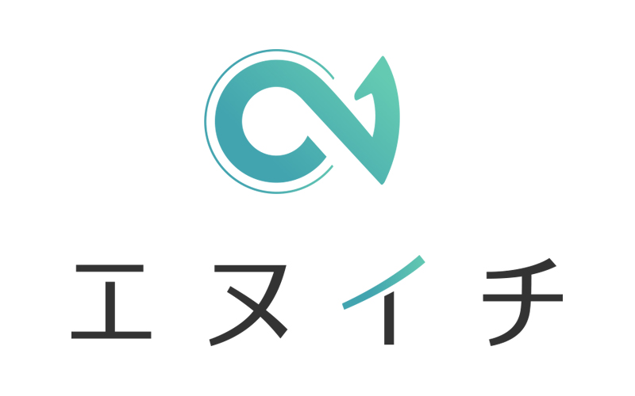

# LP ホスティング・マニュアル

> [!info] このマニュアルでできること
> XServer上で **新しいサブドメインを作って → LPを公開 → 以降は更新する** という一連の流れを、最初から最後まで通しで説明します。
> 例として `claudecode.n1-inc.co.jp/` の運用を題材にしますが、別のサブドメインでも同じ手順で公開できます。
> **対象**：HTML／サーバーの専門知識がない人。コマンド操作は使いません。すべて画面クリックで完結します。

---

## 0. 全体像（最初に押さえる）

LP公開は **4つのフェーズ** で進めます。

```
【Phase 1】サブドメインを作る              ← XServerで「住所」を用意
       ↓
【Phase 2】LPファイル（HTML）を準備する     ← 自分のPCで中身を作る
       ↓
【Phase 3】サーバーにアップロード           ← XServerに「家」を建てる
       ↓
【Phase 4】公開を確認する                   ← ブラウザで見る
```

初回はPhase 1〜4を全部やります。**2回目以降の修正は Phase 2〜4 だけ**でOK。

---

## 1. 事前に持っておくもの

| 必要なもの | 内容 | 入手方法 |
|---------|------|---------|
| XServerアカウント | サーバーパネルにログインするためのID／パスワード | 大川（r.okawa@n1-inc.co.jp）から共有 |
| サーバーID | `xs842147`（n1-inc用） | このマニュアル内に記載 |
| 親ドメイン | `n1-inc.co.jp`（XServerに登録済み） | 既設定 |
| ローカルのHTMLファイル | LP本体のHTML | 自分で用意、または既存ファイル流用 |
| 画像などの素材 | ロゴ、アイコンなど | 任意 |

> [!warning] 共有時の注意
> XServerのログイン情報は**メールやSlackで平文では送らない**。1Password等のパスワード共有機能を使う。

---

## 2. 用語ミニ辞典（最初に読む）

| 用語 | ざっくり意味 |
|-----|-----------|
| **ドメイン** | `n1-inc.co.jp` のような「住所」 |
| **サブドメイン** | `claudecode.n1-inc.co.jp` のように、メインドメインの前にくっつけた住所。1個のドメインから何個でも作れる |
| **HTML** | Webページの中身を書く言語。テキストエディタで開ける普通のファイル |
| **サーバー** | インターネット上にWebページを置いておく「倉庫」 |
| **ホスティング** | その倉庫を借りて自分のWebページを置くこと |
| **ドキュメントルート** | サーバー上で「ここに置いたファイルがWebに公開される」と決められた場所 |
| **index.html** | URLにアクセスしたとき最初に表示される特別なファイル名 |
| **SSL** | `https://` で通信を暗号化する仕組み。Chromeで「保護されていません」と出ないようにするために必要 |
| **DNS** | ドメインとサーバーを結びつける仕組み。新しいサブドメインは反映まで数分〜数十分かかる |
| **ハード再読み込み** | ブラウザのキャッシュを無視して最新版を取りに行く操作 |

---

# 【Phase 1】サブドメインを作る

> [!example] このフェーズでやること
> XServer側で `〇〇〇.n1-inc.co.jp` という新しいサブドメインを発行し、SSL（https）も有効化する。所要時間：5分の操作 ＋ 反映待ち5〜30分。

### STEP 1-1 — XServerサーバーパネルにログインする

1. ブラウザで以下にアクセス
   👉 https://www.xserver.ne.jp/login_server.php
2. **サーバーID** に `xs842147` を入力
3. **サーバーパスワード** を入力
4. 「ログイン」ボタンをクリック

> [!note] 似た画面に注意
> 「**Xserverアカウント**」と「**サーバーパネル**」の2種類があります。今回使うのは **サーバーパネル**。間違えてアカウント側に入った場合は、画面内のメニューから「サーバーパネル」に切り替え。

### STEP 1-2 — 「サブドメイン設定」を開く

1. サーバーパネルのトップで「**ドメイン**」セクションを探す
2. その中の「**サブドメイン設定**」をクリック

### STEP 1-3 — どのドメインに追加するか選ぶ

ドメイン一覧が表示されるので、`n1-inc.co.jp` の右にある「**選択する**」をクリック。

> [!warning] ドメイン選び間違えに注意
> 別ドメイン（例：個別案件のドメイン）の下にサブドメインを作ってしまうと、URLが意図したものになりません。**必ず `n1-inc.co.jp` を選択**。

### STEP 1-4 — サブドメインを追加する

1. ページ上部のタブを「**サブドメイン設定追加**」に切り替える
2. 「**サブドメイン名**」の入力欄に、作りたい名前を入れる
   - 例：`claudecode` → 完成URLは `https://claudecode.n1-inc.co.jp/`
   - 例：`event2026` → 完成URLは `https://event2026.n1-inc.co.jp/`
3. 「**コメント**」欄は任意。何用のサブドメインか書いておくと後で楽（例：「Claude Code研修LP」）
4. 「**無料独自SSLを利用する**」のチェックは **ON** のまま（重要）
5. 「**確認画面へ進む**」をクリック
6. 内容を確認し、「**追加する**」をクリック
7. 「サブドメインの追加が完了しました」と表示されればOK

> [!tip] サブドメイン名の付け方
> - 半角英数字とハイフンのみ使う（日本語・記号NG）
> - 短く・覚えやすく（メールやチラシで案内するため）
> - 既に他用途で使っているサブドメインと被らないよう確認
> - 用途が終わったら削除しないと「使われていない住所」が残るので、棚卸しのため命名規則を統一しておくと吉

### STEP 1-5 — SSL（https）の状態を確認する

1. サーバーパネルのトップに戻る
2. 「**ドメイン**」→「**SSL設定**」をクリック
3. `n1-inc.co.jp` を選択
4. 一覧の中に、いま作ったサブドメイン（例：`claudecode.n1-inc.co.jp`）が並んでいるか確認
5. SSLステータスが「**反映待ち**」または「**有効**」になっていればOK
   - **反映待ち**の場合：30分〜1時間ほどで自動的に有効になる。待つだけ。
   - **無効**の場合：右側の「**独自SSL設定追加**」から手動で有効化

> [!warning] SSLが効いていないとどうなる？
> ChromeやSafariで「**保護されていません**」と赤く警告されます。商用LPでは絶対NG。必ず有効化してから公開しましょう。

### STEP 1-6 — 反映を待つ＆動作確認

1. サブドメイン作成から **5〜30分** 待つ（DNS反映待ち）
2. ブラウザで `https://作ったサブドメイン名.n1-inc.co.jp/` を開く
3. **XServerの初期ページ**（白背景に「ご指定のページが見つかりません」等）が表示されればOK
   - これは「住所はできたけど家がまだ建ってない」状態。正常です。
4. もし「サーバーが見つかりません」エラーになる場合は、もう少し待つ

> [!success] このフェーズの完了サイン
> ブラウザで新しいサブドメインにアクセスして、何かしらの画面が出る（エラーじゃない）こと。これで「土地」が用意できました。

---

# 【Phase 2】LPファイル（HTML）を準備する

> [!example] このフェーズでやること
> サーバーに置く `index.html` を、自分のPC上で用意する。

### STEP 2-1 — HTMLを用意する

以下のいずれか：

- **新規LP**：HTMLを自分／Claude／デザイナーで作る
- **既存LPベース**：`marketing/claudecode_training_lp.html` などをコピーして書き換える

> [!tip] Claudeに頼む場合
> 「LPを作って。中身は〇〇〇」と頼めば、HTMLファイルを直接作成してくれます。レイアウトの修正も「ヒーローのキャッチコピーを△△に変えて」のように依頼可能。

### STEP 2-2 — `index.html` という名前にする

サーバー側のルールで、最初に表示するファイル名は **`index.html`** で固定です。

1. 用意したHTMLを **コピー** する（複製）
2. コピー後のファイル名を `index.html` に **リネーム**
3. デスクトップなど分かりやすい場所にまとめておく
   - 推奨：`~/Desktop/lp_deploy/index.html`

> [!warning] 元ファイルを直接リネームしない
> Vault内の元ファイル（例：`claudecode_training_lp.html`）を直接リネームすると、ソースが消えて再編集が大変になります。**必ずコピーしてからリネーム**。

### STEP 2-3 — 画像など素材も同じフォルダにまとめる

LP内で画像を使う場合、画像ファイルも一緒にアップロードする必要があります。**詳しい入れ方は後述の「画像の入れ方ガイド」章を参照**。

ローカルのフォルダ構成は最終的にこうなります：

```
~/Desktop/lp_deploy/
├── index.html
└── assets/
    ├── n1-logo.jpg        ← ロゴ
    ├── hero.png           ← ヒーロー画像
    └── icon-feature.svg   ← 機能アイコン等
```

> [!tip] 構造はそのままサーバーに移す
> ローカルのフォルダ構成 ＝ サーバー上のフォルダ構成 になるよう揃えると、画像リンク切れが起きません。

---

# 【Phase 3】サーバーにアップロード

> [!example] このフェーズでやること
> Phase 2で用意したファイル一式を、Phase 1で作ったサブドメインのフォルダにアップロードする。

### STEP 3-1 — ファイルマネージャを開く

1. XServerサーバーパネルのトップに戻る（再ログインが必要なら STEP 1-1 を参照）
2. 「**ファイル**」セクションの「**ファイルマネージャ**」をクリック
3. 新しいタブが開き、サーバー内のフォルダ一覧が表示される

### STEP 3-2 — 公開フォルダまで降りていく

ファイルマネージャの左ペインまたは中央のフォルダ一覧で、ダブルクリックで以下の順に進む：

```
n1-inc.co.jp
  └─ public_html
       └─ 〇〇〇.n1-inc.co.jp     ← Phase 1で作ったサブドメインのフォルダ
```

> [!success] 確認サイン
> Phase 1でサブドメインを作ると、`public_html/` の直下に **同じ名前のフォルダが自動的に作成**されます。このフォルダの中が、公開URLのドキュメントルート（=「家を建てる場所」）です。

> [!warning] 似た名前のフォルダに注意
> `public_html/` の直下には他のサブドメイン用フォルダや `n1-inc.co.jp` 本体のファイルも並びます。**必ず今回作ったサブドメインの名前のフォルダ**で作業すること。違うフォルダに上書きすると別サイトを壊します。

### STEP 3-3 — index.html をアップロード

1. ファイルマネージャの上部メニュー「**ファイルのアップロード**」をクリック
2. ダイアログでローカルの `index.html`（Phase 2で作ったもの）を選択
3. 「アップロード」をクリック
4. アップロード完了のメッセージが出るまで待つ（数秒〜十数秒）

> [!tip] XServer初期ファイルがある場合
> サブドメイン作成直後は `default_page.png` などの初期ファイルが入っていることがあります。`index.html` をアップロードすれば自動的に上書きされ、そちらが優先表示されるので気にしなくてOK。気になるなら右クリック→削除でも可。

### STEP 3-4 — assetsフォルダごとアップロード

1. ファイルマネージャの「**フォルダの作成**」または上部メニューから新規フォルダを作成
2. 名前を `assets` にする
3. 作った `assets` フォルダをダブルクリックで中に入る
4. 「ファイルのアップロード」で画像ファイル（`n1-logo.jpg` など）を追加

> [!tip] フォルダごと一括アップ
> XServerファイルマネージャは複数ファイルの同時アップロードに対応しています。`assets/` 内のファイルをまとめて選択してアップすれば1回で済みます。

---

# 【Phase 4】公開を確認する

> [!example] このフェーズでやること
> 実際にブラウザでアクセスして、LPが表示されるか確認。

### STEP 4-1 — ブラウザで開く

1. 新しいタブを開き、`https://〇〇〇.n1-inc.co.jp/` にアクセス
2. アップロードしたLPが表示されればOK

### STEP 4-2 — ハード再読み込みでキャッシュ回避

> [!info] ハード再読み込みのキー操作
> - **Mac**：`Cmd + Shift + R`
> - **Windows**：`Ctrl + Shift + R` または `Ctrl + F5`

普通のリロードだと古いキャッシュを表示する場合があるので、初回確認は必ずハード再読み込み。

### STEP 4-3 — 細かいチェック項目

- [ ] LPが想定通りに表示されている
- [ ] 画像（ロゴ等）が表示されている（×マークになっていない）
- [ ] アドレスバーが `https://` で、鍵マークが付いている（SSL有効）
- [ ] スマホでも崩れていない
- [ ] CTAボタンのリンクをクリックして、想定先（TimeRex、LINE、フォーム等）に飛ぶ

> [!success] このフェーズの完了サイン
> 全項目クリアで初回公開は完了です。お疲れさまでした。

---

# 【既存LPの更新】2回目以降の修正フロー

初回が終わったら、以降の修正は超シンプル。**Phase 2〜4だけ繰り返す**。

### STEP A — ローカルでHTMLを編集して `index.html` 化（=Phase 2）

### STEP B — 既存ファイルをバックアップ（必須）

万一に備えて、サーバー上の現行版を取っておく。

1. ファイルマネージャでサブドメインのフォルダに入る
2. 既存の `index.html` を右クリック → 「**ダウンロード**」
3. PCに落ちてきたファイルを `index_backup_YYYYMMDD.html` にリネームして保管

> [!tip] なぜバックアップ？
> 新版でLPが崩れたとき、このバックアップを `index.html` にリネームして再アップすれば**1分で元に戻せる**から。必ずやる。

### STEP C — 新しい `index.html` をアップロード

1. ファイルマネージャの「ファイルのアップロード」で新版を選択
2. 「**同名のファイルを上書きしますか？**」と聞かれたら **「はい」**
3. ファイル一覧の `index.html` の更新日時が今に変わっていればOK

### STEP D — ブラウザでハード再読み込みして確認（=Phase 4）

---

# 【画像の入れ方ガイド】

> [!example] この章でやること
> LPに画像（ロゴ・ヒーロー画像・アイコン等）を入れる方法を、素材の準備からHTMLの書き換え、差し替えまで通しで説明します。

## 5-1. 画像が表示される仕組み（最初に理解する）

LPで画像を見せるには、**3つが揃っている必要**があります。

```
[1] 画像ファイルが手元にある    （例：n1-logo.jpg）
[2] サーバーに画像を置いてある   （例：assets/n1-logo.jpg）
[3] HTMLが画像を呼び出している   （例：）
```

このどれか1つでも欠けると「壊れた画像アイコン（×マーク）」になります。

## 5-2. 画像ファイルを準備する

### 推奨フォーマット

| 種類 | 形式 | 用途 |
|-----|-----|------|
| 写真・複雑なグラデーション | **JPG** (`.jpg`) | ヒーロー写真、背景写真 |
| ロゴ・透過が必要なもの | **PNG** (`.png`) | ロゴ、アイコン |
| アイコン・図形 | **SVG** (`.svg`) | フラットアイコン、装飾図形 |
| 軽さ重視の写真 | **WebP** (`.webp`) | 上級者向け、ファイル小さめ |

### サイズと容量の目安

| 用途 | 推奨横幅 | ファイルサイズ目安 |
|-----|--------|----------------|
| ヒーロー画像（横長） | 1600〜2000px | 200〜500KB |
| 通常の挿絵 | 800〜1200px | 100〜300KB |
| ロゴ | 400〜800px | 50KB以下 |
| アイコン | 64〜128px | 10KB以下 |

> [!warning] 重い画像はLPの大敵
> スマホで開いたとき、5MBの画像が1枚あるだけで読み込みが数秒遅くなり、訪問者が離脱します。**1枚あたり500KB以下**を目標に。

### ファイル名のルール

- **半角英数字とハイフン・アンダースコアのみ**（日本語・スペースNG）
- 全部小文字推奨（サーバーは大文字小文字を区別する）
- 用途がわかる名前に（×：`IMG_2024.jpg`、◯：`hero-claudecode.jpg`）
- 拡張子は `.jpg` `.png` 等を確実に（例：`logo` だけだとサーバー上で開けない）

> [!tip] 命名例
> ```
> ◯ n1-logo.jpg
> ◯ hero-main.png
> ◯ icon-check.svg
> × ロゴ.jpg          （日本語）
> × Hero Image.jpg     （スペース）
> × IMG_20260429.jpg  （何の画像か不明）
> ```

### 画像の圧縮（容量削減）

撮ったまま・もらったままの画像は重すぎることが多いので圧縮する。非エンジニアでも使える無料ツール：

| ツール | URL | 特徴 |
|------|-----|------|
| **TinyPNG** | https://tinypng.com/ | ドラッグ&ドロップで圧縮。JPG/PNG対応 |
| **Squoosh** | https://squoosh.app/ | Google製。サイズ・品質を細かく調整可能 |
| **Mac標準のプレビュー** | （Macアプリ） | ファイル → 書き出す → 品質を下げる |

## 5-3. ローカルの `assets/` フォルダに配置する

1. `~/Desktop/lp_deploy/` の中に `assets/` フォルダがなければ作る
2. 圧縮した画像ファイルを全部 `assets/` に入れる
3. 最終的にこうなる：

```
~/Desktop/lp_deploy/
├── index.html
└── assets/
    ├── n1-logo.jpg
    ├── hero-main.png
    └── icon-feature.svg
```

## 5-4. HTMLに画像を呼び出す書き方

`index.html` をテキストエディタで開いて、画像を出したい場所に以下のタグを書きます。

### 基本の書き方

```html

```

要素の意味：

| 部分 | 意味 |
|------|------|
| `` | 画像を入れる命令 |
| `src="assets/n1-logo.jpg"` | 画像ファイルの場所（必須） |
| `alt="エヌイチ ロゴ"` | 画像の説明文（必須・後述） |

### 横幅を指定する書き方

```html

```

または、CSSが書ける場合は `style` で指定：

```html

```

### リンク付き画像（クリックで別ページに飛ばす）

```html
<a href="https://n1-inc.co.jp/">
  
</a>
```

### `alt` テキストは必ず書く

> [!warning] altテキストの重要性
> `alt` は画像が表示できないときの代替テキストです。書かないと：
> - **SEOに不利**（Googleが画像の中身を理解できない）
> - **アクセシビリティNG**（読み上げソフトが使えない）
> - **画像が壊れたとき何の画像か分からない**
>
> 「画像の中身を一文で説明」と覚えればOK。装飾だけの画像は `alt=""` （空）にする。

## 5-5. 「相対パス」のルール（つまずきやすいポイント）

`src="assets/n1-logo.jpg"` の書き方を **相対パス** と呼びます。`index.html` から見てどこにあるかを示します。

```
[index.html がある場所]
├── index.html              ← ここから見て
└── assets/
    └── n1-logo.jpg          ← 「assets/n1-logo.jpg」と書けば届く
```

> [!tip] よくあるミスと対処
> | 書き方 | 結果 |
> |--------|------|
> | `src="assets/n1-logo.jpg"` | ◯ 正しい |
> | `src="/assets/n1-logo.jpg"` | △ 先頭スラッシュは「サーバー直下」の意味になる。サブドメインによってはOK |
> | `src="./assets/n1-logo.jpg"` | ◯ 「同じ場所の」を明示。意味は同じ |
> | `src="assets\n1-logo.jpg"` | × バックスラッシュは使わない（Windows風） |
> | `src="C:\Users\...\n1-logo.jpg"` | × 自分のPCのパスを書いてもサーバーでは無意味 |

## 5-6. サーバーにアップロードする

Phase 3のSTEP 3-4と同じ手順：

1. ファイルマネージャでサブドメインのフォルダに入る
2. `assets` フォルダがなければ「フォルダの作成」で作る
3. `assets` フォルダの中に入って、画像ファイルを全部アップロード
4. 完成後のサーバー側はこうなる：

```
〇〇〇.n1-inc.co.jp/
├── index.html
└── assets/
    ├── n1-logo.jpg
    ├── hero-main.png
    └── icon-feature.svg
```

5. ブラウザで `https://〇〇〇.n1-inc.co.jp/` をハード再読み込みして画像が出るか確認

## 5-7. 画像を差し替えたいとき

### A. 同じ画像を新しいバージョンに更新する場合（おすすめ）

1. 新しい画像を **既存と同じ名前** にリネーム（例：`n1-logo.jpg`）
2. ファイルマネージャでサブドメインの `assets/` フォルダに入る
3. アップロードで上書き
4. ブラウザでハード再読み込み

> [!success] HTMLの書き換え不要
> 同じファイル名で上書きすれば、HTMLのコードは1行も変えなくてOK。最も安全で楽な方法。

### B. 別の名前の画像に差し替える場合

1. 新しい画像（例：`hero-v2.png`）をローカルの `assets/` に追加
2. `index.html` を開いて `src="assets/古い名前.png"` を `src="assets/hero-v2.png"` に書き換え
3. ローカルの `index.html` をサーバーに上書きアップロード
4. 新画像も `assets/` にアップロード
5. ハード再読み込みで確認

> [!warning] ファイル名と書き換えはセットで
> ファイル名を変えたらHTMLも書き換える、書き換えたらアップする。**片方だけだと必ず画像が壊れます**。

## 5-8. 画像の入れ方トラブルシューティング

### 「壊れた画像アイコン（×マーク）になる」

サーバー側で `https://〇〇〇.n1-inc.co.jp/assets/画像名.jpg` を直接アドレスバーに入れて開いてみる。

- **画像が表示される**：HTMLの `src` のスペルが間違っている
- **404エラー**：画像がアップロードされていない、またはフォルダ違い
- **403エラー**：パーミッション問題。ファイルマネージャで再アップロードしてみる

### 「画像が大きすぎてレイアウトが崩れる」

`` タグに `style="width: 100%; max-width: 800px;"` を追加すると、親要素に合わせて縮みつつ、最大サイズも決められる。

### 「画像が読み込み遅い」

- ファイルサイズを確認（500KB以上なら圧縮を）
- TinyPNGやSquooshで圧縮し直す
- 写真ならJPG、ロゴならPNGまたはSVGに形式を見直す

### 「Retinaディスプレイで画像がぼやける」

表示したいサイズの **2倍** で書き出すとシャープに見える。
例：横400pxで表示したいなら、ファイルは横800pxで作る。

---

## 6. トラブルシューティング

### 「サブドメインを作ったのに、ブラウザで表示されない」

- [ ] **DNS反映待ち**：作成から30分以内なら待つ
- [ ] **URLのスペルミス**：`https://` で始めているか、サブドメイン名にタイポがないか
- [ ] **SSL反映待ち**：「保護されていません」警告だけならアクセス自体はできるはず

### 「変更が反映されない」

- [ ] ハード再読み込みをやったか？（`Cmd+Shift+R`）
- [ ] アップロード先のフォルダは正しいサブドメインのフォルダか？
- [ ] ファイル名は `index.html`（小文字・拡張子.html）か？ `Index.html` や `index.HTML` はNG
- [ ] スマホで見ても同じか？（PCのキャッシュ問題切り分け）

### 「ページが真っ白／崩れている」

すぐにバックアップを戻す。
1. STEP Bで取っておいた `index_backup_YYYYMMDD.html` を `index.html` にリネーム
2. STEP Cと同じ手順で上書きアップロード
3. ハード再読み込みで元に戻ったか確認

### 「画像が表示されない／壊れた画像アイコンが出る」

→ 「画像の入れ方ガイド」章末（5-8）の **トラブルシューティング** を参照。

### 「ログインできない」

- サーバーIDは `xs842147`（数字を打ち間違えやすい）
- パスワードは1Password等で再確認
- それでもダメなら大川（r.okawa@n1-inc.co.jp）に連絡

---

## 7. やってはいけないこと（重要）

> [!danger] NGリスト
> - ❌ **作ったサブドメイン以外のフォルダにアップロードする**（他サイトを壊す）
> - ❌ **`index.html` 以外の名前でアップする**（公開URLに表示されない）
> - ❌ **バックアップを取らずに上書きする**（戻せなくなる）
> - ❌ **XServerのログイン情報をメール／Slackで平文共有する**（漏洩リスク）
> - ❌ **サーバーパネルの「ドメイン削除」「サーバー初期化」をいじる**（取り返しがつかない）
> - ❌ **SSLを「無効」に切り替える**（公開LPが警告まみれになる）

---

## 8. 困ったらここを見る

- **このマニュアル**：`marketing/claudecode_lp_deploy_guide.md`
- **公開ログ（claudecode.n1-inc.co.jpの技術詳細）**：`marketing/claudecode_lp_deploy_log.md`
- **既存LPのソースHTML（参考）**：`marketing/claudecode_training_lp.html`
- **連絡先**：大川 龍之介（r.okawa@n1-inc.co.jp / 080-2646-2420）

---

## 9. 全体フロー早見表（印刷用）

```
━━━ 初回公開 ━━━

[Phase 1] サブドメインを作る
  1-1. XServerサーバーパネルにログイン（ID: xs842147）
  1-2. ドメイン → サブドメイン設定
  1-3. n1-inc.co.jp を選択
  1-4. サブドメイン名を入力 → 追加（無料SSLはON）
  1-5. SSL設定で「有効」または「反映待ち」を確認
  1-6. 5〜30分待つ → ブラウザで初期ページが見えればOK
        ↓
[Phase 2] LPファイルを準備
  2-1. ローカルでHTMLを用意・編集
  2-2. コピーを作って index.html にリネーム
  2-3. 画像は assets/ フォルダにまとめる
        ↓
[Phase 3] サーバーにアップロード
  3-1. ファイルマネージャを開く
  3-2. n1-inc.co.jp / public_html / 〇〇〇.n1-inc.co.jp に降りる
  3-3. index.html をアップロード
  3-4. assets フォルダ作成 → 画像アップロード
        ↓
[Phase 4] 公開確認
  4-1. https://〇〇〇.n1-inc.co.jp/ をハード再読み込み
  4-2. SSL（鍵マーク）・画像・リンクをチェック
        ↓
            ✅ 完了

━━━ 2回目以降の更新 ━━━

A. ローカルで編集 → index.html
B. 既存をダウンロードしてバックアップ
C. 新しい index.html をアップロード（上書き「はい」）
D. ハード再読み込みで確認
```
